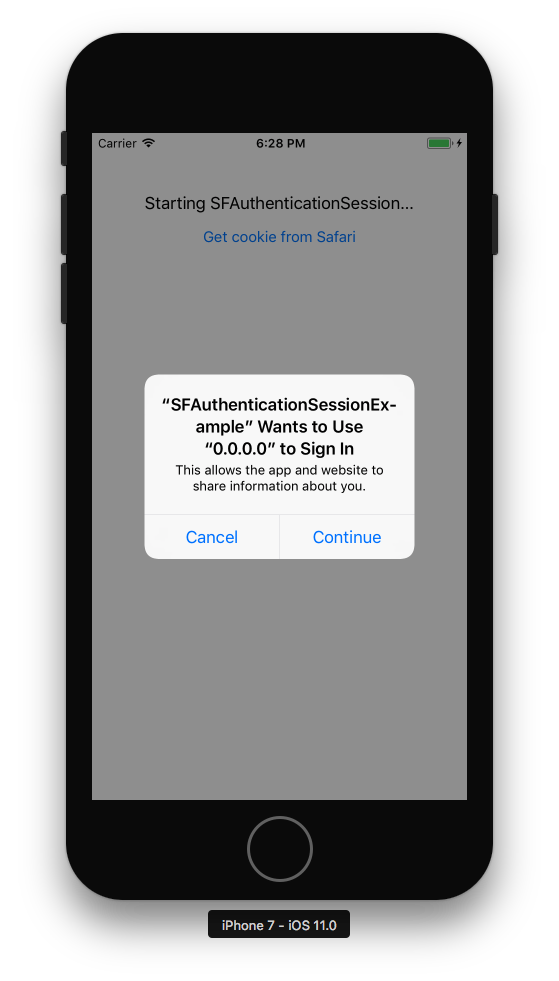

# Use SFAuthenticationSession to get cookies from Safari

Example using iOS 11's [SFAuthenticationSession](https://developer.apple.com/documentation/safariservices/sfauthenticationsession) to get cookies from Safari. Contains a simple python Flask web service to create and return cookies and an iOS app that uses SFAuthenticationSession API to fetch cookies from the Flask app. Assumes you have some level of familiarity with Xcode and the command line, but does not require experience with python / Flask.

**Note:** *There appears to be [a bug with SFAuthenticationSession](https://twitter.com/rmondello/status/887434621989789696) that prevents this from working for [cookies that are set with no expiry](https://stackoverflow.com/questions/46569570/sfauthenticationsession-isnt-sharing-cookies-on-the-real-devices) / with the lifetime of a session cookie, even if those sessions are still alive.*

## Running

You will need to start the Flask server, and run the iOS app in the simulator using xcode 9.

### Run the Server

The following assume you have python 2.7 installed and set as your default python version:

```bash
cd server
pip install virtualenv
source env/bin/activate
pip install -r requirements.txt
python app.py
```

Go to [http://0.0.0.0:5000/](http://0.0.0.0:5000/) in your browser to confirm the app is working. You should see something like the following:

```
Simple flask app to create and get cookies. Can redirect to a callbackUrl to deep link into app.

Example using cookie "user" - replace with any cookie of your choice:
/create-cookie/user - sets random cookie val for "user"
/get-cookie/user - gets cookie val for "user" with optional query param "callbackUrl" to be redirected to with cookie appended as query param
/delete-cookie/user - expires cookie for "user"

Current cookies set are:

```

You can click around to test the endpoints. Navigating to `/create-cookie/user` creates a cookie for the key `user`, but you could use any key you want, for example `/create-cookie/sessionID` to create a random cookie value for the key `sessionID`.

### Run the App

Xcode 9 and iOS 11 are required to run the app. To attempt fetching cookies from Safari, do the following:

1. Run the app in a device simulator.
2. From the simulator exit the app by pressing the home button and go to safari.
3. Go to http://0.0.0.0:5000/create-cookie/expiry-fix-test to create a cookie for the key "expiry-fix-test". Update the value of `cookiename` to use a different key / value pair.
4. Go back to the app in the simulator and click the "Get cookie from Safari" button.
5. You will see a dialogue like the following: 

6. Click continue; a SafariViewController will be launched and then you should be redirected back into your app with the cookie for "expiry-fix-test" shown in the app.
